# HairCLIP의 Train 과정 코드 리뷰

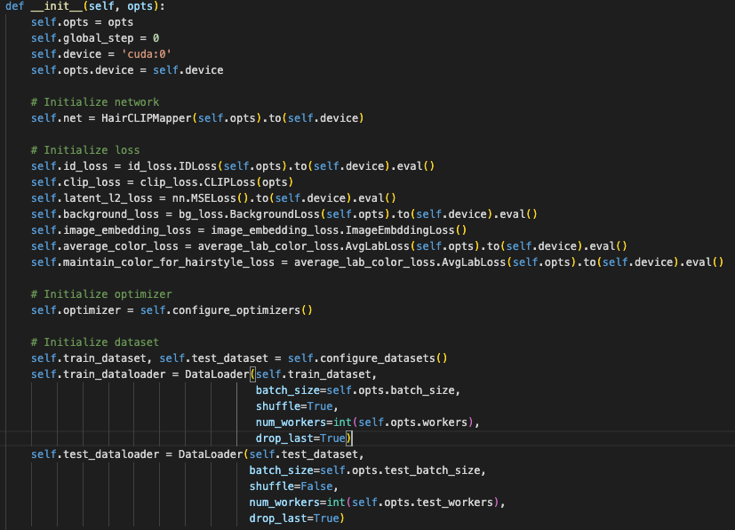

Coach 클래스(coach.py) 에서는 HairCLIPMapper 라는 클래스를 통해서 network 구조를 초기화해준다. HairCLIPMapper 클래스부터 알아보도록 한다.

# HairCLIPMapper

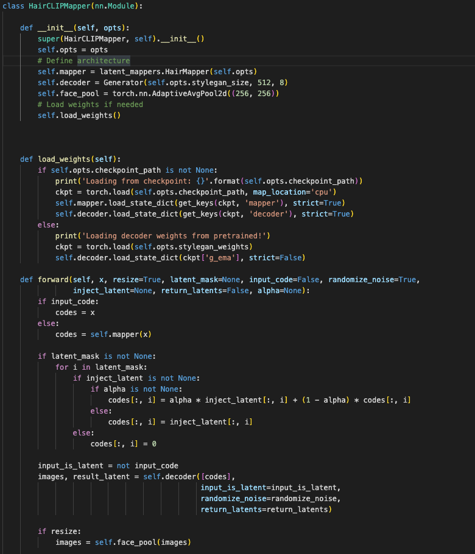

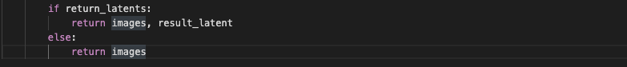

 여기서는 HairMapper 클래스를 사용한다… HairMapper 클래스로~

# HairMapper

 HairCLIPMapper 클래스에서 **__init__** 함수에서 HariMapper 클래스를 통해 HairCLIP 아키텍처를 정의한다. 즉, HairMapper 클래스에서 본 논문에서 중요하게 다룬 아키텍처가 정의되어 있다는 것을 알 수 있다. HairMapper 클래스의 코드를 살펴보도록 한다.

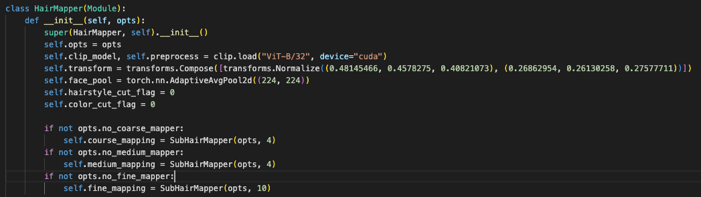

 __init __함수의 아래 쪽 코드를 보면, “coarse_mapping”, “medium_mapping”, “fine_mapping”이라는 클래스 변수를 확인할 수 있는데, 4, 4, 10인 인자를 SubHairMapper 클래스에 넣어준다. 익숙한 단어와 익숙한 숫자다. coarse, medium(middle), fine은 StyleGAN 에서 중요하게 다뤄졌던 부분인데, style이 미치는 영향력의 규모를 뜻한다. (coarse 쪽일수록 영향력이 크다)

 근데 StyleGAN 뿐만이 아니라, HairCLIP 에서도 해당 부분을 중요하게 다룬다. 어떻게? Hair에서도 Coarse, Medium, Fine 으로 Style의 영향력을 구분한 것이다. 헤어 스타일에서도 “헤어의 색깔"과 “헤어의 스타일"을 구분지은 것이다. HairCLIP의 아키텍처의 일부분을 보며 이해해보자.

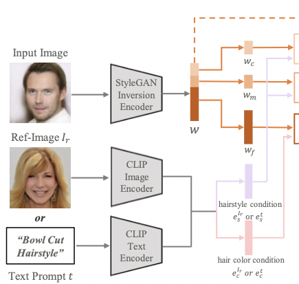

 헤어스타일에서 “색"과 “스타일"을 구분한 뒤, Coarse와 Medium은 ‘헤어스타일’ 을 의미하고 Fine 은 “헤어 색깔"을 의미하게 된다. 

 근데 SubHairMapper 라는 클래스의 인스턴스 변수이다. SubHairMapper 클래스에 대해 알아보자. 이전에 SubHairMapper 클래스에서 사용되는 ModulationModule 클래스부터 살펴본다. 

## ModulationModule

 우선 코드를 살펴보기 전, ModulationModule의 역할에 대해 살펴본다. 결국 Modulation Module은 hairstyle만 변경시키거나 color만 변경시키거나 hairstyle과 color만 변경시키는 것을 쉽게 해준다.

(latent vector w가 들어오면, FC layer를 거치면 x 가 나온다.)

 그러면 HairMapper 클래스를 포함하는 “latent_mappers.py” 파일을 확인해보면, 논문에서 중요하게 다루는 ModulationModule 클래스가 있다.

- ModulationModule 클래스의 forward 과정을 보면서 논문과 비교하면서 구조를 확인해본다.

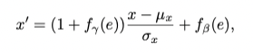

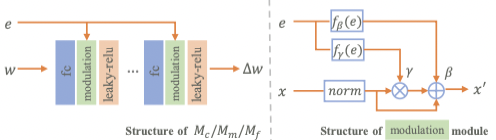

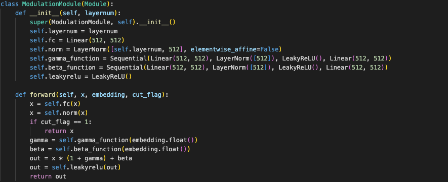

논문에서 주장하는 ModulationModule 의 아키텍처와 코드 상에서의 아키텍처를 비교해보면, 굉장히 흡사하다는 것을 알 수 있다.

- 여기서 x는 fc layer의 출력 값을 의미하고, e 는 embedding 결과를 의미한다. 해당 함수가 쓰이는 부분을 보면 e가 어떤 embedding 결과를 의미하는지 알 수 있겠지만 함수를 보기 전 e에 대해 예측해보자면, 본 논문(HairCLIP)에서 이용하는 embedding 된 latent vector는 e4e 인코딩을 통해 얻어진 latent vector라 예측된다. 추후 확인해보도록 한다.
- 코드 상에서는 LeakyReLU 함수를 거치지만 논문상에서는 생략되었다. 이 점만 제외하면 논문과 똑같다는 것을 확인할 수 있다.

---

이제 SubHairMapper 클래스를 알아본다.

## SubHairMapper

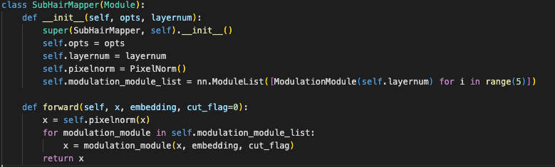

 SubHairMapper 클래스에서의 forward 과정을 보면 x 를 PixelNorm 과정을 거치게 한 뒤, ModulationModule을 총 5번 거치게 한다. 

- PixelNorm : [models.stylegan2.model.py](http://models.stylegan2.model.py) 참조

 근데 앞에서 중요하게 본 부분인 Coarse, Medium, Fine 을 SubHairMapper 클래스의 매개변수로 지정하는 듯 해보였다. 

 즉, 그 숫자들은 layernum 이라는 인스턴스 변수에 입력되었다. layernum은 다시 ModulationModule의 layernum 인스턴스 변수로 전달된다. 

 ModulationModule의 layernum 변수는 LayerNorm()함수의 인자 ⇒ **[self.layernum, 512]** 로 사용된다. 굉장히 중요해보이지만 무슨 내용인지 잘 모르겠다. LayerNorm 함수에서의 인자가 그렇게 중요한가… 

- 참고한 사이트
    - [https://yonghyuc.wordpress.com/2020/03/04/batch-norm-vs-layer-norm/](https://yonghyuc.wordpress.com/2020/03/04/batch-norm-vs-layer-norm/)
    - [https://m.blog.naver.com/sogangori/221035995877](https://m.blog.naver.com/sogangori/221035995877)
- LayerNorm 함수는 BatchNorm 과는 달리, 하나의 sample 의 모든 feature들의 평균과 분산을 구한다. (BatchNorm 은 하나의 feature의 평균과 분산을 구한다.) 즉, LN은 데이터를 정규화하는 것이다. 채널 수(feature 개수)만큼 평균과 분산을 계산해내야 한다.

# HairCLIP의 전체적인 아키텍처

 HairMapper, SubHairMapper, ModulationModule 클래스를 리뷰하고 난 뒤 HairCLIP 논문의 전체적인 아키텍처를 확인해본다. 

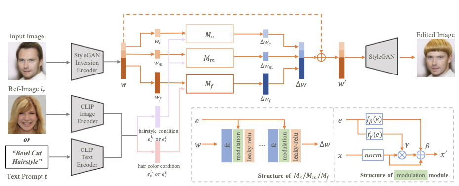

 Mc, Mm, Mf 는 같은 네트워크를 가지는 구조(FC layer - ModulationModule - LeakyReLU)의 프레임워크이며, SubHairMapper 인스턴스들인 것을 알 수 있다. 

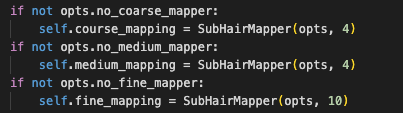

> 그렇다면 위에서 본 HairMapper 는 어느 부분에 속할까?
> 

 

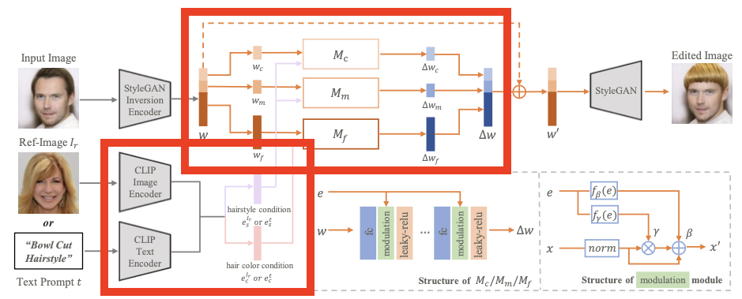

 아마 저 위에 빨간색 박스 부분 2개에 해당할 것이다. HairMapper 클래스에서는 CLIP 모델을 통해 이미지 혹은 Text를 Encoding하며 encoding 결과를 Mc, Mm, Mf (SubHairMapper 클래스)에서 ∆w를 계산한다. 하지만 forward 과정에서 w’ 를 계산하진 않고, ∆w 까지만 계산하고 return 하게 된다. 그럼 어디에서 w 와 ∆w 를 더해서 w’ 를 만들어내는가?? ⇒ **HairCLIPMapper 클래스**

**이렇게 HairMapper 클래스의 초기화 과정을 훑어봤다. 이제 다시 HairCLIPMapper 클래스로 돌아가서 살펴본다.**

---

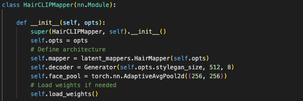

 인스턴스 변수 decoder 는 StyleGAN2의 생성자(Generator)를 의미한다. face_pool 변수는 적응형 평균 Pooling을 의미한다. 이렇게 아키텍처를 결정하고, weight를 가져온다. (pretrain된 StyleGAN의 가중치 값을 이용한다) 

 **즉, HairMapper 의 forward 과정을 통해 return 된 ∆w는 HairCLIPMapper 네트워크에서 기존 latent vector w 와 합쳐져 w’ 가 계산되고 계산된 w’를 통해 StyleGAN2 Generator에 넣어줘서 새로운 이미지가 생성된다는 것을 알 수 있다.** 

**이제 Coach 클래스의 Network를 초기화하는 과정까지 살펴보았다. 그리고 Dataset을 초기화해주는 부분을 보도록 한다.**

# Dataset 초기화

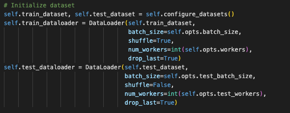

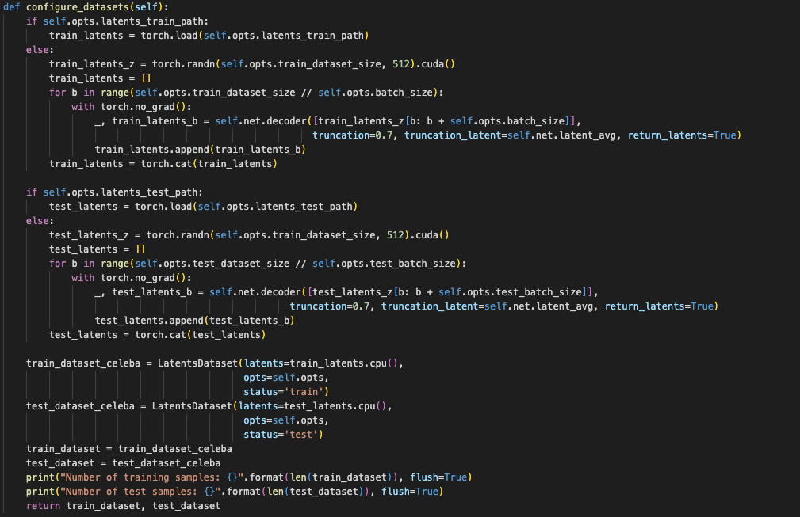

 우선 [coach.py](http://coach.py)파일에서 train/test dataset을 configure_datasets() 라는 함수에서 초기화해주는 것을 확인할 수 있다. configure_datasets() 함수를 살펴보면, Train 시킬 때 옵션으로 준 “latents_train_path” 를 통해 latent vector 를 가져온다. 그 latent vector는 **사전 학습된 E4E의 인코딩을 통해 얻어낸 CelebA-HQ dataset의 latent vector들** 이다. 

 이 latent vector들은 LatentDataset 의 인자로 사용되고 얻어진 LatentDataset 인스턴스들이 리턴된다. 즉, LatentDataset 인스턴스들이 HairCLIPMapper 네트워크에서  LatentDataset 클래스를 알아보자. 

### LatentDataset 클래스

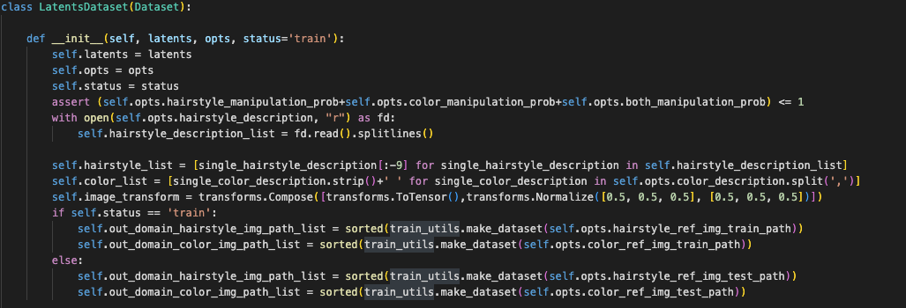

 별다른 것 없이, Train 시킬 때 option 값으로 준 “hairstyle_ref_train_path”, “color_ref_img_train_path” 를 out_domain_hairstyle_img_path_list와 out_domain_color_img_path_list 라는 인스턴스 변수로 받아온다. (해당 리스트에는 이미지의 PATH가 들어가있다 - training/train_util.make_dataset() 함수 참고)

# Train 과정

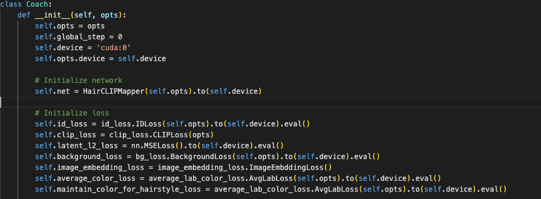

 Coach 클래스에서는 HairCLIPMapper 네트워크를 생성하고, 손실함수, Dataset, optimizer, logger, checkpoint dir 을 초기화해준다.

- *Network와 Dataset 이외에 loss, optimizer, logger, checkpoint dir 을 초기화해주는데 이들의 초기화 과정까지는 쫓아가며 살펴보지 않겠다. 전체적인 아키텍처와 train 과정에 집중해서 보도록 한다.*

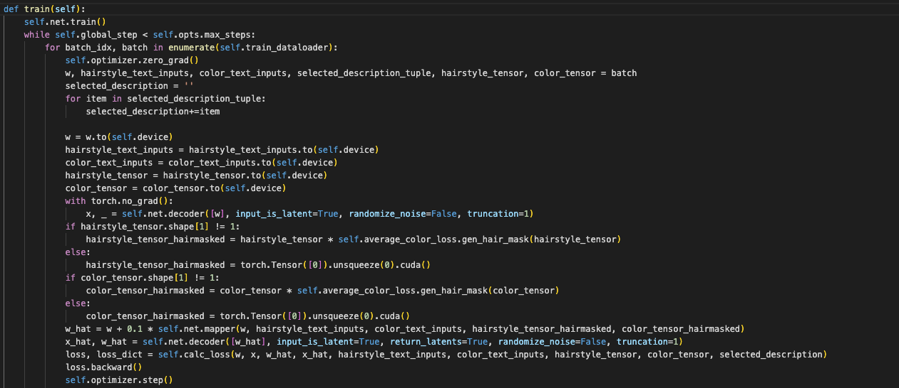

**Coach 클래스에서의 train 함수의 코드 한줄한줄 리뷰** 

- HairCLIPMapper.train() : train 모드로 변경!
- w_hat 은 논문에서 언급된 w’ 을 의미한다.
    - HairMapper 네트워크를 통해서 w_hat이 계산된다.
- selected_description : 선택된 항목들 리스트
- hairstyle_text_input VS hairstyle_tensor
    - hairstyle_text_input : “Afro hairstyle” 과 같이, 텍스트로 헤어스타일을 변경할 때 사용되는 텍스트 리스트를 의미한다.
    - hairstyle_tensor : 본 논문에서는 Reference Image를 통해서 헤어스타일을 변경시킬 수도 있다고 했는데, 그 Reference image가 hairstyle_tensor를 의미한다.
- x는 latent vector w를 이용해서 StyleGAN2 Generator에 의해 생성된 이미지를 의미하고, x_hat 은 w_hat을 토대로 StyleGAN2 Generator에 의해 생성된 이미지를 의미한다.
- w와 w_hat을 토대로 생성된 이미지 2개(x, x_hat)를 통해 loss 값을 계산하고, optimizer를 통해 가중치를 업데이트한다.

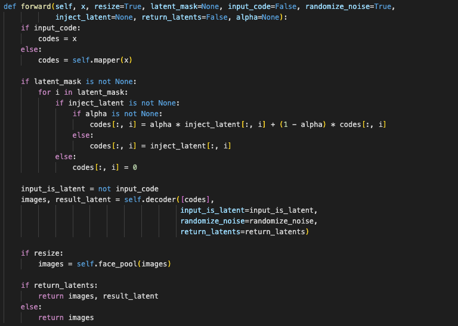

 HairCLIPMapper 클래스에서 가중치가 정해진 뒤 학습이 진행된다. 아래의 이미지는 HairCLIPMapper 클래스의 forward 함수이다. 코드를 보면 알 수 있듯이, ‘codes’라는 지역변수는 HairMapper 네트워크의 forward 과정을 거치고 난 뒤의 결과값이다. 

## HairMapper 네트워크 forward 과정 (중요!!)

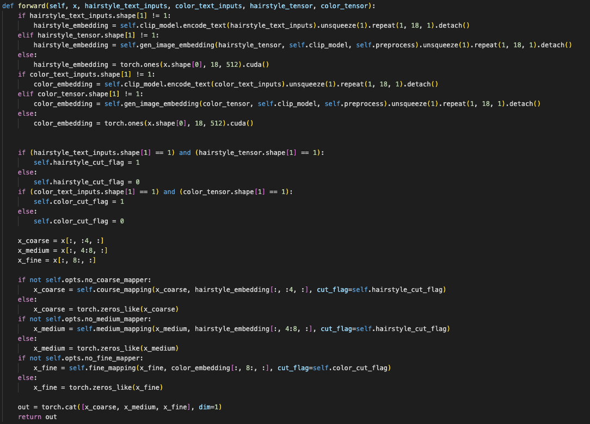

 그럼 HairMapper의 forward 과정을 자세히 살펴본다. 앞에서 if - elif - else 문이 보이는데 이는 HairCLIP 에서 주장한 바와 같이, text나 image 두 방식으로 모두 hairstyle 혹은 hair color를 embedding하는 것을 알 수 있다.

 또한, 해당 forward 함수의 인자로 들어온 x 값은 HairCLIPMapper 의 forward 과정에서 생성된 latent vector이다.

HairMapper 네트워크의 forward 결과값을 StyleGAN2 Generator 네트워크의 입력값으로 넣어준다. 

- input_is_latent : 입력값이 latent vector인지
- randomize_noise : 노이즈 값을 랜덤하게 구성 했는지 (초기값을 랜덤하게 설정했는지를 의미하는 것 같다)
- return_latents : 결과값으로 image와 함께 latent_code도 받을지를 의미함

Generator를 통해 어떤 것을 생성하는가? ⇒ image와 latent_code를 생성한다. 

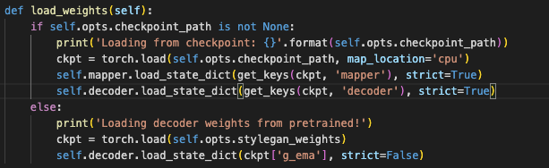

# 모르겠는 부분

- latent_mappers.py 의 HairMapper 클래스에서 ‘transform’, ‘face_pool’ 이라는 인스턴스 변수가 있는데 이것들이 의미하는 바는 무엇인지?
    - torch.nn.AdaptiveAvgPool2d 함수는 여러 입력 평면으로 구성된 입력 신호에 2D 적응형 평균 Pooling을 적용한다고 한다.
        - **적응형 평균 Pooling?? 무슨 말인지?**
    - torchvision.transforms.Compose 함수는 어떤 역할을 하는지? 이미지를 변형시키는 것 같은데 StyleGAN2 generator를 통한 것이 아니라 그냥 기본함수인 것 같은데 다른 참고사이트를 봐도 잘 모르겠다.
    - 해당 파일에서 torchvision.transforms.Compose 함수에 인자로 넣어준 저 의미 없는 숫자는 뭔지…
    
    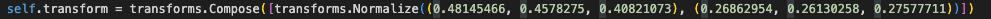
    

- (해결) ~~CLIP encoder를 통해 나온 hairstyle condition / haircolor condition은 다른 layer에 입력된다. 임베딩되는 결과는 어디??~~
    - HairMapper 네트워크의 forward 과정

- (해결) ~~논문에서 말한 Mc, Mm, Mf 는 같은 네트워크를 가지는 SubHairMapper라고 한다. 이 네트워크들을 거치면 latent vector w 에서 ∆w 가 나오는데 ∆w가 의미하는 바는 무엇인지??~~
    
    $$
    w′ = w + ∆w
    $$
    
    - 라는 식을 보면, ∆w 는 기존 w에서 변경해줄 vector 방향 및 크기를 담고 있는 것 같아보인다.
    - 전체적인 아키텍처에서 보면 기존에 E4E 인코더를 통해 이미지를 Embedding 해서 만든 latent vecotr w 에 ∆w를 더해서 w’ 를 만들고 StyleGAN2 Generator를 통해 새로운 이미지를 만들어낸다.

- HairMapper 클래스의 forward 함수에서의 매개변수 x는 어디에서 입력되는지… 알아서 train_dataset 이나 test_dataset에서 가져오는건가? dataset에서 하나의 이미지를 의미하는 것 같긴한데, HairCLIPMapper 클래스에서 HairMapper 클래스의 forward 함수에 하나의 이미지를 넣어주는 부분은 찾지 못했다.

- mapper/datasets/latents_dataset.py 파일에서 “hairstyle_list.txt” 파일과 “color_description” 옵션에서 하나하나의 color와 hairstyle로 읽어온다. 
    - ‘Afro hairstyle’로 manipulation을 한다고 하면, 어떻게 afro hairstyle로 바꿔주는지?? 'afro hairstyle'이라는 text는 StyleCLIP에서도 잘 동작하는 것인지?? 
    - 우리의 데이터('박서준 머리', '2013GD') 로 하려면, hairstyle_list.txt 파일(텍스트)이 아닌 Reference image를 통한 방식이 필요한 것 같아보인다.